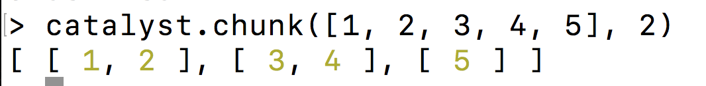
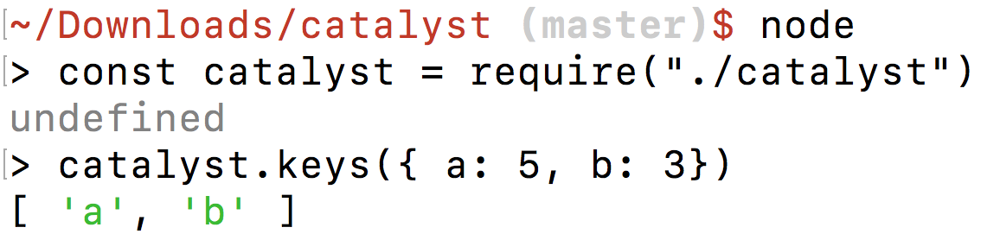
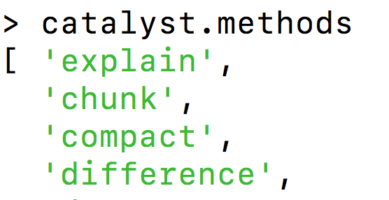

# Catalyst

**Catalyst** is a JavaScript utility library for common operations with
arrays, objects, strings, numbers and more. It is built with ES6.



# Setup Instructions

An installation of [Node](https://nodejs.org/en/) is required for this demo.

1) Download or clone repository from GitHub.
2) Unzip to reveal a `catalyst-master` directory.
3) Navigate into `catalyst-master` and execute `npm install`
The command will generate a catalyst.js file within the folder.
4) Open the Node REPL by executing `node` in Terminal.
5) Require the catalyst library and assign it to a constant.

`const catalyst = require("./catalyst")`
6) Use `catalyst` to test the functionalities of the library.

```javascript
catalyst.invert({
  a: 2,
  b: 3
});

//--> {2: "a", 3: "b"}
```



# Features

- Utilize 30+ helper methods including `intersection`, `assign` and `compact`
- Discover available methods through `methods` property



- Access comprehensive documentation for any method by passing its
name as a string to the `explain` method

```
catalyst.explain("chunk");
```

